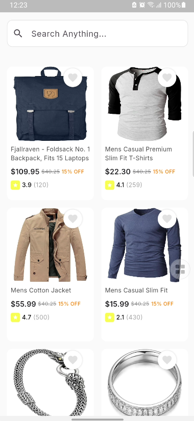
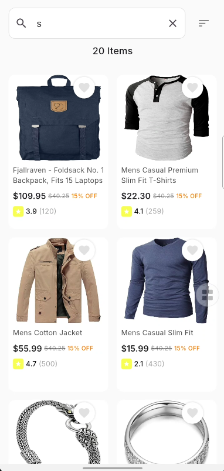
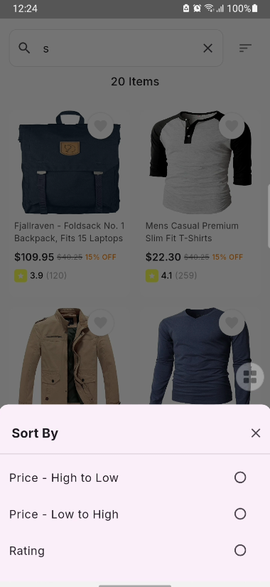
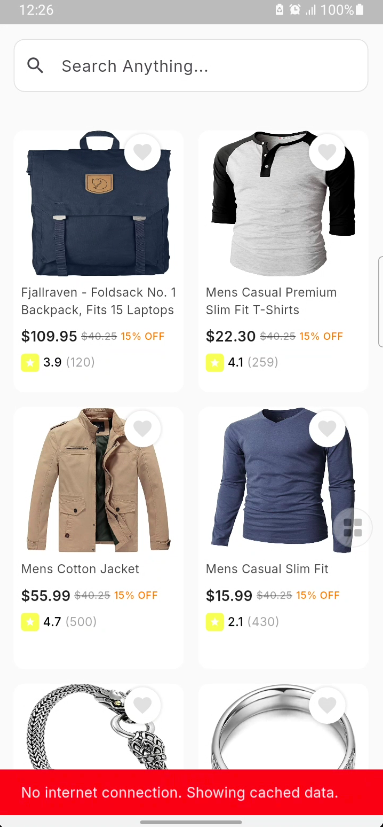
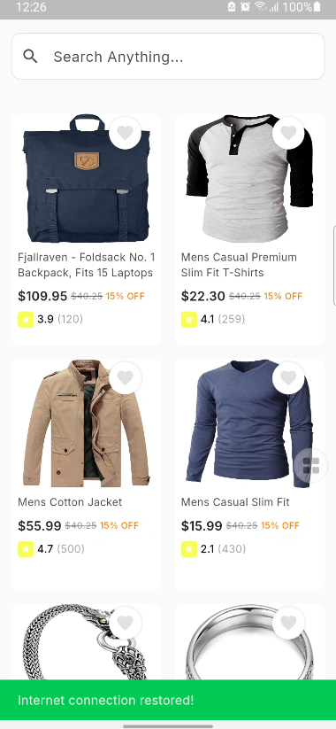
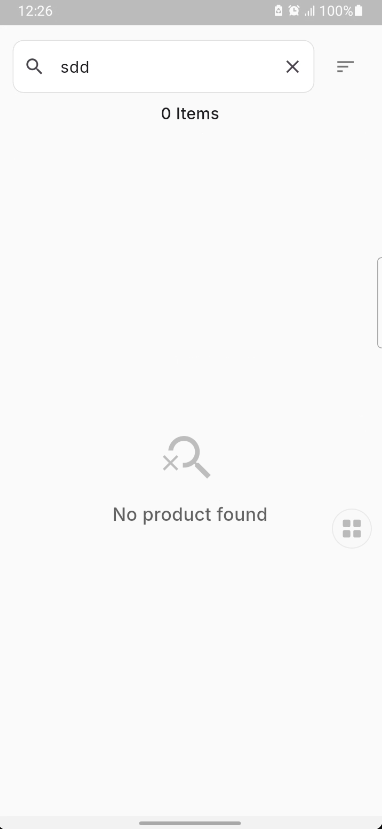

# E-Commerce Product Listing App

A modern Flutter application showcasing e-commerce products with a clean architecture design. This app demonstrates best practices in Flutter development, including state management, caching, and responsive UI design.

## Screenshots

<div align="center">
  <!-- Add your screenshots here -->
  <p>
    
    
    
  </p>
  <p>
    
    
    
  </p>
</div>

> Note: To add your own screenshots:
>
> 1. Take screenshots of your app running on a device or emulator
> 2. Save them to the `assets/screenshots/` directory
> 3. Update the image paths in the README.md file

## Features

- **Product Listing**: Display products in a visually appealing grid layout
- **Search Functionality**: Filter products by search terms
- **Sorting Options**: Sort products by price (high to low, low to high) and rating
- **Offline Mode**: Cache products for offline viewing
- **Responsive Design**: Optimized for various screen sizes
- **Clean Architecture**: Well-organized codebase with separation of concerns

## Architecture

The project follows Clean Architecture principles with the following layers:

### 1. Presentation Layer

- **Screens**: UI components for displaying data
- **Widgets**: Reusable UI components
- **BLoCs**: Business Logic Components for state management

### 2. Domain Layer

- **Entities**: Core business models
- **Repositories**: Abstract definitions of data operations
- **Use Cases**: Application-specific business rules

### 3. Data Layer

- **Models**: Data classes for mapping from/to JSON
- **Repositories**: Concrete implementations of domain repositories
- **Data Sources**: Remote (API) and local (Hive) data providers

### 4. Core

- **Services**: Common functionality like network and connectivity
- **Utils**: Helper methods and utility functions

## Technical Details

### State Management

- Flutter Bloc for reactive state management
- BLoC pattern for separating business logic from UI

### Data Persistence

- Hive for local data storage
- Cached network images for efficient image loading

### Network

- Dio for HTTP requests
- Connectivity monitoring for network status

## Packages Used

### Main Dependencies

| Package | Version | Purpose |
|---------|---------|---------|
| flutter_bloc | ^9.1.0 | State management using BLoC pattern |
| dio | ^5.8.0+1 | HTTP client for API requests |
| hive | ^2.2.3 | Lightweight and fast NoSQL database |
| hive_flutter | ^1.1.0 | Flutter extensions for Hive |
| path_provider | ^2.1.1 | File system location access |
| fpdart | ^1.1.1 | Functional programming utilities |
| connectivity_plus | ^5.0.2 | Network connectivity monitoring |
| cached_network_image | ^3.3.1 | Efficient image caching |
| shimmer | ^3.0.0 | Shimmer loading effects |
| flutter_cache_manager | ^3.3.1 | File download caching |
| cupertino_icons | ^1.0.8 | iOS-style icons |

### Dev Dependencies

| Package | Version | Purpose |
|---------|---------|---------|
| flutter_lints | ^5.0.0 | Lint rules for Flutter apps |
| hive_generator | ^2.0.1 | Code generator for Hive |
| build_runner | ^2.4.6 | Dart code generation |
| mockito | ^5.4.4 | Mocking for tests |

## Getting Started

### Prerequisites

- Flutter SDK: ^3.7.2
- Dart SDK: ^3.7.2

### Installation

1. Clone the repository:

```
git clone https://github.com/your-username/E-Commerce-Product-Listing-App.git
```

2. Navigate to the project directory:

```
cd E-Commerce-Product-Listing-App
```

3. Install dependencies:

```
flutter pub get
```

4. Run the app:

```
flutter run
```

## Project Structure

```
lib/
├── core/                  # Core functionality
│   ├── services/          # Network, connectivity, and cache services
│   └── utils/             # Helper methods and utilities
├── data/                  # Data layer
│   ├── datasources/       # Remote and local data sources
│   ├── models/            # Data models and mappers
│   └── repositories/      # Repository implementations
├── domain/                # Domain layer
│   ├── entities/          # Business entities
│   ├── repositories/      # Repository interfaces
│   └── usecases/          # Business logic use cases
├── presentation/          # Presentation layer
│   ├── blocs/             # BLoC state management
│   ├── screens/           # App screens
│   └── widgets/           # Reusable UI components
└── main.dart              # App entry point
```

## UI Components

- **HomeScreen**: Main product listing screen with search and sorting
- **ProductTile**: Card widget for displaying individual products
- **NoDataWidget**: Empty state widget for network errors

## Code Highlights

### BLoC Pattern Implementation

The app uses the BLoC pattern to manage state, with distinct events, states, and bloc classes for different features:

- **ProductBloc**: Manages product loading, filtering, and sorting
- **ConnectivityBloc**: Monitors network connectivity
- **ScrollBloc**: Handles scroll position and pagination

### Offline-First Approach

The app follows an offline-first approach with:

- Local caching of products using Hive
- Image caching with cached_network_image
- Smart refresh strategy when connectivity is restored

### Performance Optimizations

- Lazy loading of images
- Efficient state updates with BLoC
- Minimal rebuilds with targeted widget updates

## Contributing

1. Fork the repository
2. Create your feature branch: `git checkout -b feature/amazing-feature`
3. Commit your changes: `git commit -m 'Add some amazing feature'`
4. Push to the branch: `git push origin feature/amazing-feature`
5. Open a Pull Request

## License

This project is licensed under the MIT License - see the LICENSE file for details.
